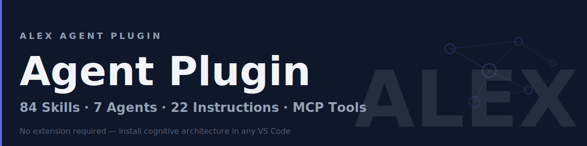

# 🧠 Alex Agent Plugin

> **Install Alex's cognitive architecture in VS Code — no extension needed.**

<p align="center">
  
</p>

---

## What Is This?

Alex is an AI cognitive architecture that makes GitHub Copilot smarter. Instead of a generic assistant, you get a partner with **84 domain skills**, **7 specialist agents**, **22 auto-loaded instructions**, **11 prompt workflows**, and **MCP-powered cognitive tools** — all without installing a VS Code extension.

---

## Quick Install (30 seconds)

### Windows (PowerShell)

```powershell
irm https://raw.githubusercontent.com/fabioc-aloha/AlexAgent/main/install.ps1 | iex
```

### macOS / Linux (Bash)

```bash
curl -fsSL https://raw.githubusercontent.com/fabioc-aloha/AlexAgent/main/install.sh | bash
```

### After Installation

1. **Restart VS Code** (or press `Ctrl+Shift+P` → "Reload Window")
2. **Open Copilot Chat** (`Ctrl+Alt+I`)
3. **Say hello**: Type "Who are you?" — Alex will introduce himself

---

## Requirements

- **VS Code 1.110+** (agent plugins support)
- **GitHub Copilot** subscription (Individual, Business, or Enterprise)
- **Git** (for installation and updates)

---

## Updating

```bash
cd ~/.alex-agent && git pull
```

Then reload VS Code.

---

## Troubleshooting

**Alex doesn't respond** — Check VS Code is 1.110+, and that `chat.agent.enabled` and `chat.plugins.enabled` are `true` in settings.

**Skills don't load** — Reload VS Code (`Ctrl+Shift+P` → "Reload Window"). Try asking directly: "Load the testing-strategies skill".

**MCP tools unavailable** — Install [Node.js](https://nodejs.org/).

---

## Plugin vs Extension

| Feature | Plugin | Extension |
|---------|:------:|:---------:|
| Skills, Agents, Instructions | ✅ | ✅ |
| `@alex` chat participant | — | ✅ |
| Welcome panel with avatar | — | ✅ |
| 90 extension commands | — | ✅ |
| Episodic memory & task detection | — | ✅ |

Want the full experience? Install the [Alex Cognitive Architecture extension](https://marketplace.visualstudio.com/items?itemName=fabioc-aloha.alex-cognitive-architecture) from the VS Code Marketplace.

---

## License

Apache 2.0 — See [LICENSE](LICENSE)

## Links

- 🏠 [Alex Cognitive Architecture](https://github.com/fabioc-aloha/Alex_Plug_In) — Main project
- 📦 [VS Code Marketplace](https://marketplace.visualstudio.com/items?itemName=fabioc-aloha.alex-cognitive-architecture) — Full extension
- 📖 [User Manual](https://github.com/fabioc-aloha/Alex_Plug_In/blob/main/alex_docs/guides/USER-MANUAL.md) — Documentation

---

## Appendix

<details>
<summary><strong>Manual Installation</strong></summary>

#### Windows

```powershell
git clone https://github.com/fabioc-aloha/AlexAgent.git $env:USERPROFILE\.alex-agent
```

#### macOS / Linux

```bash
git clone https://github.com/fabioc-aloha/AlexAgent.git ~/.alex-agent
```

Then add to your VS Code `settings.json`:

```json
{
  "chat.agent.enabled": true,
  "chat.plugins.enabled": true,
  "chat.plugins.paths": {
    "~/.alex-agent/plugin": true
  }
}
```

</details>

<details>
<summary><strong>Skills (84)</strong></summary>

Skills are domain knowledge Alex loads on demand:

| Category | Skills |
|----------|--------|
| **Security** | secrets-management, distribution-security, security-review |
| **Testing** | testing-strategies, root-cause-analysis, debugging-patterns |
| **Documentation** | markdown-mermaid, doc-hygiene, knowledge-synthesis |
| **Development** | vscode-extension-patterns, mcp-development, refactoring-patterns |
| **AI/ML** | prompt-engineering, ai-character-reference-generation, image-handling |

Ask Alex about any topic — he'll load the relevant skill automatically.

</details>

<details>
<summary><strong>Agents (7)</strong></summary>

Switch personas for specialized tasks:

| Agent | Use When |
|-------|----------|
| **@Alex** | General assistance (default) |
| **@Researcher** | Deep exploration, finding patterns |
| **@Builder** | Implementing features, writing code |
| **@Validator** | Code review, testing, quality assurance |
| **@Documentarian** | Writing docs, READMEs, guides |
| **@Azure** | Azure deployment, infrastructure |
| **@M365** | Microsoft 365, Teams, Graph API |

</details>

<details>
<summary><strong>Prompts (11)</strong></summary>

Reusable workflows available as `/` commands:

- `/rca` — Root cause analysis workflow
- `/refactor` — Safe refactoring procedure
- `/debug` — Systematic debugging
- `/security-review` — Security audit checklist
- `/knowledge` — Search cross-project knowledge
- And more...

</details>

<details>
<summary><strong>Instructions (22)</strong></summary>

Auto-loaded rules that apply based on what you're editing:

- Editing `*.test.ts`? Testing best practices load automatically
- Working in `azure/`? Azure deployment patterns activate
- Touching security files? Security review guidelines appear

</details>

---

<p align="center">
  <em>Alex — The AI that grows with you</em>
</p>
